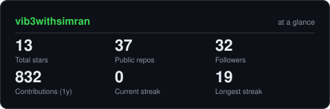
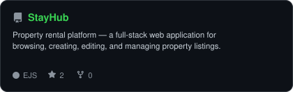
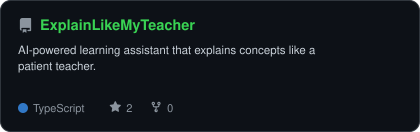
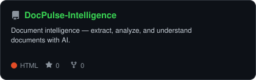
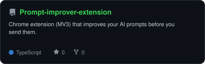

<div align="center">

<!-- PORTRAIT - generated by scripts/dotify.py from img.png -->


<!-- NAME / TAGLINE - animated typing -->
<a href="https://github.com/vib3withsimran">

</a>
<br>

<!-- SOCIALS -->
<a href="https://linkedin.com/in/mssimran"></a>
<a href="mailto:mssimran093@gmail.com"></a>
<a href="https://simran-os-portfolio.netlify.app"></a>
<a href="https://codolio.com/profile/vib3withsimran"></a>
<a href="https://leetcode.com/u/vib3withsimran"></a>
<a href="https://www.codeforces.com/profile/vib3withsimran"></a>
</div>

---

## `~/` whoami

```console
$ cat about.txt
```

Hi, I'm **Simran Gupta** (she/her). I build polished web apps that sit somewhere between clean UI and solid engineering,
and I solve problems for fun when neither of those is cooperating.

- Currently building **[StayHub](https://github.com/vib3withsimran/StayHub)**
- Portfolio: **[simran-os-portfolio.netlify.app](https://simran-os-portfolio.netlify.app)**
- Learning **Machine Learning**
- Consistent in **DSA**
- Fun fact: **I started coding seriously because I wanted to build things I wished existed.**

<br>

<div align="center">

## `~/` toolbox


</div>

---

<div align="center">

## `~/` skill radar

<table>
<tr>
<td width="50%" align="center" valign="middle">
<!-- Self-rated radar - edit assets/skills.json, re-run radar.py -->
<picture>
<source media="(prefers-color-scheme: dark)" srcset="assets/radar-dark.svg">
<source media="(prefers-color-scheme: light)" srcset="assets/radar-light.svg">

</picture>
</td>
<td width="50%" align="center" valign="middle">
<!-- Live radar built from real language byte counts across your repos -->
<picture>
<source media="(prefers-color-scheme: dark)" srcset="assets/radar-langs-dark.svg">
<source media="(prefers-color-scheme: light)" srcset="assets/radar-langs-light.svg">

</picture>
</td>
</tr>
</table>

</div>

---

<div align="center">

## `~/` contribution calendar

<!-- 3D isometric calendar, regenerated by .github/workflows/metrics.yml -->

<br><br>

<!-- Snake eats the contribution graph -->
<picture>
<source media="(prefers-color-scheme: dark)" srcset="https://raw.githubusercontent.com/vib3withsimran/vib3withsimran/snake-output/github-snake-dark.svg">
<source media="(prefers-color-scheme: light)" srcset="https://raw.githubusercontent.com/vib3withsimran/vib3withsimran/snake-output/github-snake.svg">

</picture>

</div>

---

<div align="center">

## `~/` the numbers

<!-- Generated by scripts/cards.py — self-hosted, never goes down -->
<picture>
<source media="(prefers-color-scheme: dark)" srcset="assets/card-stats-dark.svg">
<source media="(prefers-color-scheme: light)" srcset="assets/card-stats-light.svg">

</picture>
<br>

<br><br>


</div>

---

<div align="center">

## `~/` selected work

<!-- Cards generated by scripts/cards.py from assets/projects.json -->
<table>
<tr>
<td width="50%">
<a href="https://github.com/vib3withsimran/StayHub">
<picture>
<source media="(prefers-color-scheme: dark)" srcset="assets/card-StayHub-dark.svg">
<source media="(prefers-color-scheme: light)" srcset="assets/card-StayHub-light.svg">

</picture>
</a>
</td>
<td width="50%">
<a href="https://github.com/vib3withsimran/ExplainLikeMyTeacher">
<picture>
<source media="(prefers-color-scheme: dark)" srcset="assets/card-ExplainLikeMyTeacher-dark.svg">
<source media="(prefers-color-scheme: light)" srcset="assets/card-ExplainLikeMyTeacher-light.svg">

</picture>
</a>
</td>
</tr>
<tr>
<td width="50%">
<a href="https://github.com/vib3withsimran/DocPulse-Intelligence">
<picture>
<source media="(prefers-color-scheme: dark)" srcset="assets/card-DocPulse-Intelligence-dark.svg">
<source media="(prefers-color-scheme: light)" srcset="assets/card-DocPulse-Intelligence-light.svg">

</picture>
</a>
</td>
<td width="50%">
<a href="https://github.com/vib3withsimran/Prompt-improver-extension">
<picture>
<source media="(prefers-color-scheme: dark)" srcset="assets/card-Prompt-improver-extension-dark.svg">
<source media="(prefers-color-scheme: light)" srcset="assets/card-Prompt-improver-extension-light.svg">

</picture>
</a>
</td>
</tr>
</table>
<sub>

| project | stack |
|---|---|
| **[StayHub](https://github.com/vib3withsimran/StayHub)** | `Node.js` `Express` `MongoDB` `EJS` |
| **[ExplainLikeMyTeacher](https://github.com/vib3withsimran/ExplainLikeMyTeacher)** | `TypeScript` `React Native` |
| **[DocPulse-Intelligence](https://github.com/vib3withsimran/DocPulse-Intelligence)** | `Python` `HuggingFace` |
| **[Prompt-improver-extension](https://github.com/vib3withsimran/Prompt-improver-extension)** | `React` `TypeScript` `Supabase` |

</sub>
</div>

---

<div align="center">

## GitHub Trophies


</div>

---

<div align="center">

## GSSoC 2026

<div style="display:flex;flex-wrap:nowrap;justify-content:center;align-items:center">
  <a href="https://gssoc.girlscript.org/profile/6ea84c93-6344-4507-a256-efb36b07b3ed"></a>
  <a href="https://gssoc.girlscript.org/profile/6ea84c93-6344-4507-a256-efb36b07b3ed"></a>
  <a href="https://gssoc.girlscript.org/profile/6ea84c93-6344-4507-a256-efb36b07b3ed"></a>
  <a href="https://gssoc.girlscript.org/profile/6ea84c93-6344-4507-a256-efb36b07b3ed"></a>
  <a href="https://gssoc.girlscript.org/profile/6ea84c93-6344-4507-a256-efb36b07b3ed"></a>
  <a href="https://gssoc.girlscript.org/profile/6ea84c93-6344-4507-a256-efb36b07b3ed"></a>
</div>

</div>

---

<div align="center">

## Random Dev Quote


</div>
